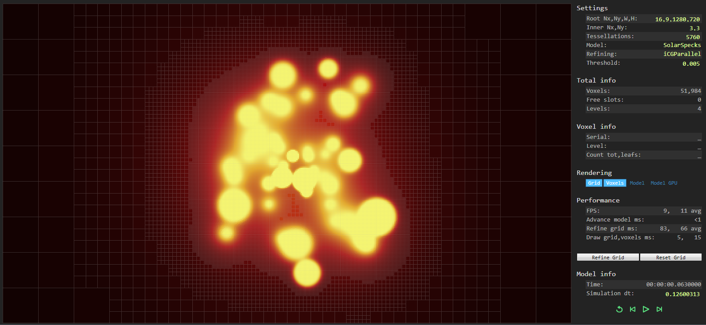
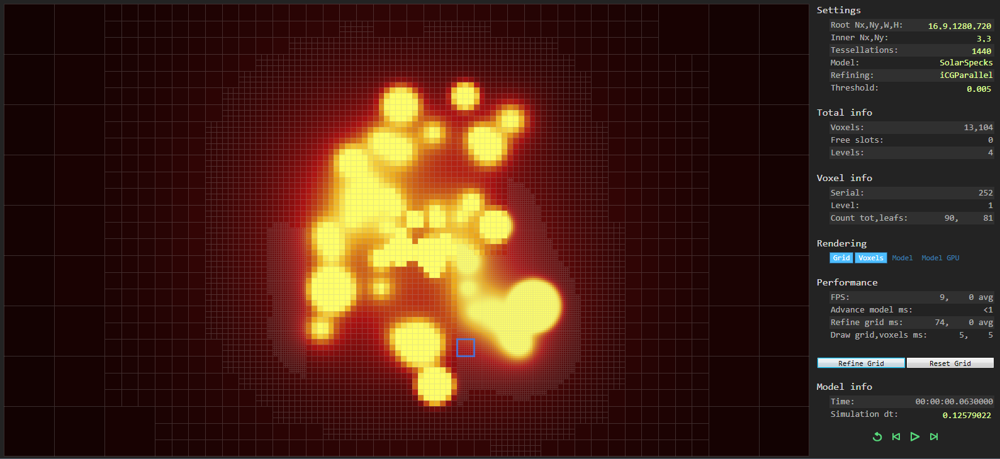
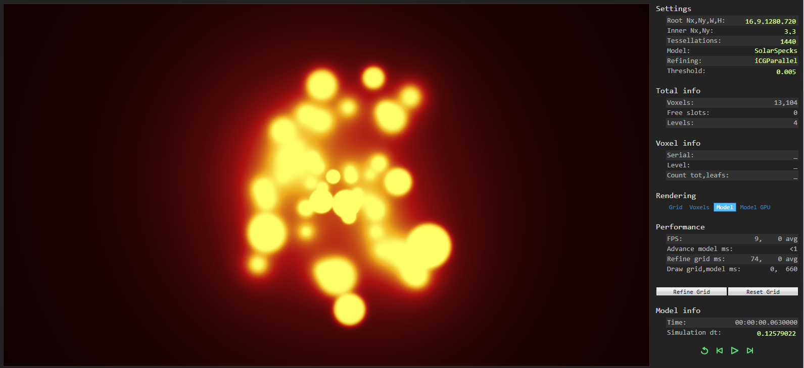

# Cognita
### Concept
This is the educational project with main purpose is to develop and test the multidimensional adaptive grid which can be used in 
[Reinforcement Learning](https://en.wikipedia.org/wiki/Reinforcement_learning) area. 
Additional purpose of this project is to learn and try CUDA programming with [Alea GPU](http://www.aleagpu.com/release/3_0_4/doc/).  

In typical reinforcement learning scenario an agent takes actions corresponding to current policy and state of an environment.
Adaptive grid is needed to represent a manifold of possible actions of an agent and manifold of states of an environment with ability to 
adjust grid resolution in regions of interest. The concept of adaptive refinement of the manifolds of possible states and actions 
is close to common learning practices (for example, in learning of car driving at a very first stage there is no need for any distinction
of severity of bends, instead, the only distinction between left and right turns could be suitable. The more experience and average speeds,
the more details about bends and the more precise steering are needed for further improvement of driving skills)  

### Implementation
The class [_AdaptiveGrid_](https://github.com/zubetto/Cognita/blob/be324e36a6f88cd0f0c868d00be35bdcfbe5d534/Cognita/AdaptiveGrid.cs#L610)
is implemented as voxel tree. Each voxel exposes its properties and methods through the 
[_IVoxel_](https://github.com/zubetto/Cognita/blob/be324e36a6f88cd0f0c868d00be35bdcfbe5d534/Cognita/AdaptiveGrid.cs#L38) interface. 
The  maximum number of voxels and shape of the grid are set at creation time of the _AdaptiveGrid_ instance and can't be changed 
during the  liftime of the instance. The voxels are stored in the internal single-dimensional array, which entirely initialized at creation 
time of the _AdaptiveGrid_ instance. So, during different manipulations with the grid (voxel tessellation or merging), 
voxels only are changed their properties and no voxel instances are created or deleted. The grid can be processed in multithreaded manner. 
The methods 
[_RefineGrid_CGParallel_](https://github.com/zubetto/Cognita/blob/be324e36a6f88cd0f0c868d00be35bdcfbe5d534/TestWpf/MainWindow.xaml.cs#L1509), 
[_RefineGrid_FGParallel_](https://github.com/zubetto/Cognita/blob/be324e36a6f88cd0f0c868d00be35bdcfbe5d534/TestWpf/MainWindow.xaml.cs#L1816) 
and others represent templates of multithreaded processing and also show how the voxel iterator 
[_NextAtLevel_](https://github.com/zubetto/Cognita/blob/be324e36a6f88cd0f0c868d00be35bdcfbe5d534/Cognita/AdaptiveGrid.cs#L1042) works.  

### Tests
The _TestWpf_ project is intended for testing of two-dimensional `AdaptiveGrid<double>` instances, for estimation of performance 
of the grid processing methods and for trying some CUDA programming, which in this case was used for bitmaps calculation. 
The _TestWpf_ has graphical output for visual presentation of the grid and voxels. Several simple abstract 
[models](https://github.com/zubetto/Cognita/blob/017159c9b97a8967549c4e3340b8caf37366ccb7/ModelFunctions/ModelFunctions.cs#L1238) 
were created for the 
testing of the grid refinement processes and for fun in some ways.  

<iframe src="https://player.vimeo.com/video/263415756?autoplay=1&title=0&byline=0&portrait=0" width="640" height="360" frameborder="0" webkitallowfullscreen mozallowfullscreen allowfullscreen></iframe>
 

